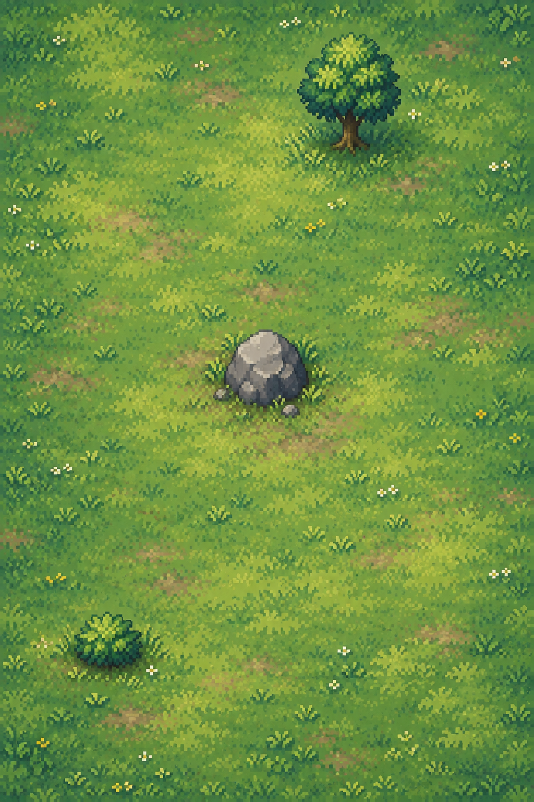

# Forest composition sample — pending human review

This is one **unapproved composition reference**, generated with Codex's built-in
image tool and ingested as the `sample` source role. It is not a final background,
TileSet, collision map, approved candidate, or promoted runtime asset.

The original PNG is preserved byte-for-byte: 1024 × 1536, RGB, opaque, SHA-256
`c67502d762649ec770338422e6aaf31594ef4362db2b65f39c6285478e3d833e`.
The [exact prompt](composition-prompt.txt) and [generation record](generation-record.json)
record the tool mode, input-plan hash, output hash, actual dimensions, and ingestion command.
The workspace image is
`assets-source/forest-arena/forest-v1/sources/c67502d762649ec770338422e6aaf31594ef4362db2b65f39c6285478e3d833e.png`.
Only one generation call was made; there was no paid API fallback or corrective retry.

## Technical review

The portrait framing, sparse major objects, open spawn neighborhoods, and routes
around the rock are useful for reviewing the intended style. There are no
characters, labels, grid lines, HUD elements, or border barriers.

The sample is **not ready to align with gameplay geometry**:

- The northern tree and southern shrub appear left of their specified positions;
  the shrub is also too high. All ground contacts require overlay inspection and
  correction before a final background is authored.
- Raised grass tufts and a small pebble near the rock could imply extra blockers.
  Decoration must remain visibly distinct from the four explicit arena footprints.
- The output is not a native 360 × 540 pixel canvas or an integer enlargement of
  one. A final pixel grid and consistent sprite-to-ground scale remain to be chosen.
- The canopy is baked into an opaque image; separate layers, depth ordering, and
  overhead occlusion remain unverified.

The source plan remains the geometry authority: ground 360 × 540, cell size 20,
spawns `(80,160)` and `(280,380)`, rock `[150,240,60,60]`, trunk `[240,65,30,35]`,
canopy `[215,35,80,70]`, shrub `[75,440,45,25]`. No geometry was inferred or changed
from image pixels. Movement, projectile, sight, and occlusion flags remain separate.

Next: human composition/style feedback, corrected art aligned to the explicit
layout, then a real sample approval before completing the final artwork. The
`background` source role is deliberately unbound. No keypose/sample approval,
final review receipt, compilation, or promotion was performed.
